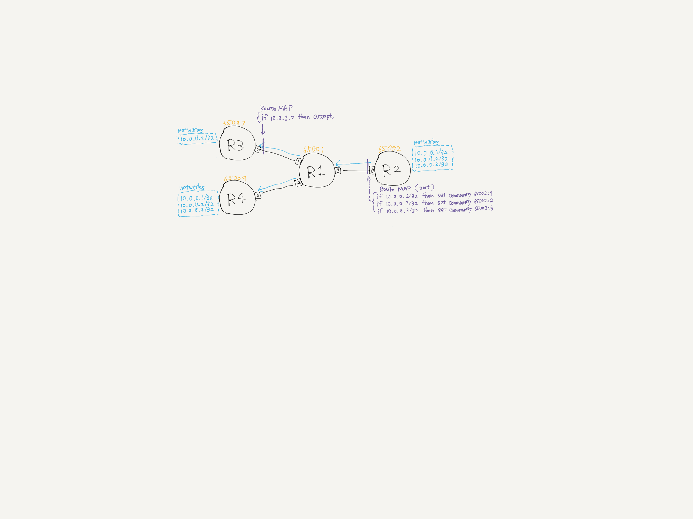

# BGP route-map playground (import-prefix-filter)



```
docker exec R3 vtysh -c 'show bgp ipv4 unicast'
BGP table version is 1, local router ID is 10.255.0.3, vrf id 0
Status codes:  s suppressed, d damped, h history, * valid, > best, = multipath,
               i internal, r RIB-failure, S Stale, R Removed
Nexthop codes: @NNN nexthop's vrf id, < announce-nh-self
Origin codes:  i - IGP, e - EGP, ? - incomplete

   Network          Next Hop            Metric LocPrf Weight Path
*> 10.0.0.2/32      net0                                   0 65001 65002 i

Displayed  1 routes and 1 total paths
```
```
docker exec R4 vtysh -c 'show bgp ipv4 unicast'
BGP table version is 3, local router ID is 10.255.0.4, vrf id 0
Status codes:  s suppressed, d damped, h history, * valid, > best, = multipath,
               i internal, r RIB-failure, S Stale, R Removed
Nexthop codes: @NNN nexthop's vrf id, < announce-nh-self
Origin codes:  i - IGP, e - EGP, ? - incomplete

   Network          Next Hop            Metric LocPrf Weight Path
*> 10.0.0.1/32      net0                                   0 65001 65002 i
*> 10.0.0.2/32      net0                                   0 65001 65002 i
*> 10.0.0.3/32      net0                                   0 65001 65002 i

Displayed  3 routes and 3 total paths
```

