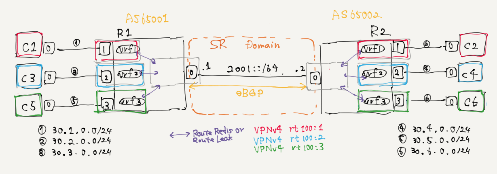

# FRR meets BGP-SRv6-VPNv4

MP-BGP VPNv4 per-VRF w/ SRv6..?



```
$ make sh_route_vrfs

[[R1-glb]]
169.254.99.10 dev vrf1 scope link
169.254.99.20 dev vrf2 scope link
169.254.99.30 dev vrf3 scope link
1:1::  encap seg6local action End.DX4 nh4 169.254.99.10 dev net0 metric 1024 pref medium
1:2::  encap seg6local action End.DX4 nh4 169.254.99.20 dev net0 metric 1024 pref medium
1:3::  encap seg6local action End.DX4 nh4 169.254.99.30 dev net0 metric 1024 pref medium
2:1:: via 2001::2 dev net0 metric 1024 pref medium
2:2:: via 2001::2 dev net0 metric 1024 pref medium
2:3:: via 2001::2 dev net0 metric 1024 pref medium
2001::/64 dev net0 proto kernel metric 256 pref medium
fe80::/64 dev net0 proto kernel metric 256 pref medium

[[R1-vrf1]]
30.1.0.0/24 dev net1 proto kernel scope link src 30.1.0.1
30.2.0.0/24  encap seg6 mode encap segs 1 [ 2:1:: ] dev net0 scope link

[[R1-vrf2]]
30.3.0.0/24 dev net2 proto kernel scope link src 30.3.0.1
30.4.0.0/24  encap seg6 mode encap segs 1 [ 2:2:: ] dev net0 scope link

[[R1-vrf3]]
30.5.0.0/24 dev net3 proto kernel scope link src 30.5.0.1
30.6.0.0/24  encap seg6 mode encap segs 1 [ 2:3:: ] dev net0 scope link

[[R2-glb]]
169.254.99.10 dev vrf1 scope link
169.254.99.20 dev vrf2 scope link
169.254.99.30 dev vrf3 scope link
1:1:: via 2001::1 dev net0 metric 1024 pref medium
1:2:: via 2001::1 dev net0 metric 1024 pref medium
1:3:: via 2001::1 dev net0 metric 1024 pref medium
2:1::  encap seg6local action End.DX4 nh4 169.254.99.10 dev net0 metric 1024 pref medium
2:2::  encap seg6local action End.DX4 nh4 169.254.99.20 dev net0 metric 1024 pref medium
2:3::  encap seg6local action End.DX4 nh4 169.254.99.30 dev net0 metric 1024 pref medium
2001::/64 dev net0 proto kernel metric 256 pref medium
fe80::/64 dev net0 proto kernel metric 256 pref medium

[[R2-vrf1]]
30.1.0.0/24  encap seg6 mode encap segs 1 [ 1:1:: ] dev net0 scope link
30.2.0.0/24 dev net1 proto kernel scope link src 30.2.0.1

[[R2-vrf2]]
30.3.0.0/24  encap seg6 mode encap segs 1 [ 1:2:: ] dev net0 scope link
30.4.0.0/24 dev net2 proto kernel scope link src 30.4.0.1

[[R2-vrf3]]
30.5.0.0/24  encap seg6 mode encap segs 1 [ 1:3:: ] dev net0 scope link
30.6.0.0/24 dev net3 proto kernel scope link src 30.6.0.1
```

