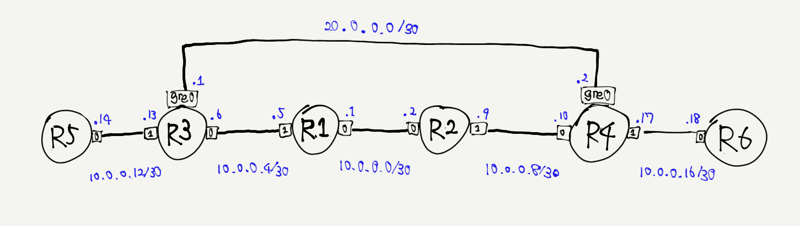

# GRE



```
modprobe ip_gre
ip tunnel add <IF_NAME> mode gre remote <REMOTE_IPV4_ADDR> local <LOCAL_IPV4_ADDR> ttl <TTL>
ip link set <IF_NAME> mtu <MTU> up
ip addr add <LOCAL_IPV6_ADDR>/<PREFIXLEN> dev <IF_NAME>
```
