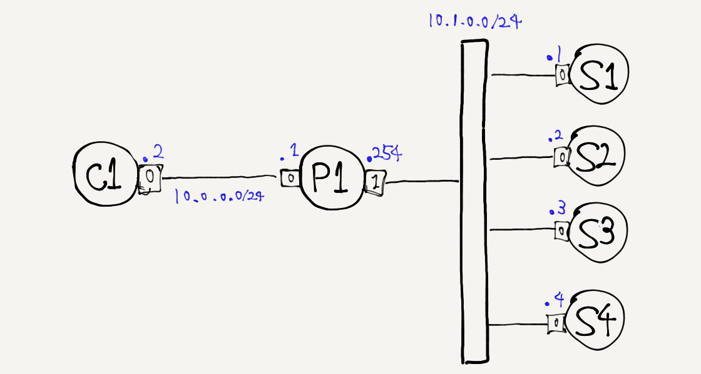

# HAProxy demonstration



**How to test**<br>
P1 is configured HAProxy container as-a TCP proxy.
You can check the behabiour of proxy when you run
the curl command to access 10.0.0.1(P1's address) on C1.
```
$ cd /path/to/here
$ tn upconf | sudo sh
...
$ docker exec C1 curl -s 10.0.0.1
S1
$ docker exec C1 curl -s 10.0.0.1
S2
$ docker exec C1 curl -s 10.0.0.1
S3
$ docker exec C1 curl -s 10.0.0.1
S4
$ docker exec C1 curl -s 10.0.0.1
S1
$ docker exec C1 curl -s 10.0.0.1
S2
```
