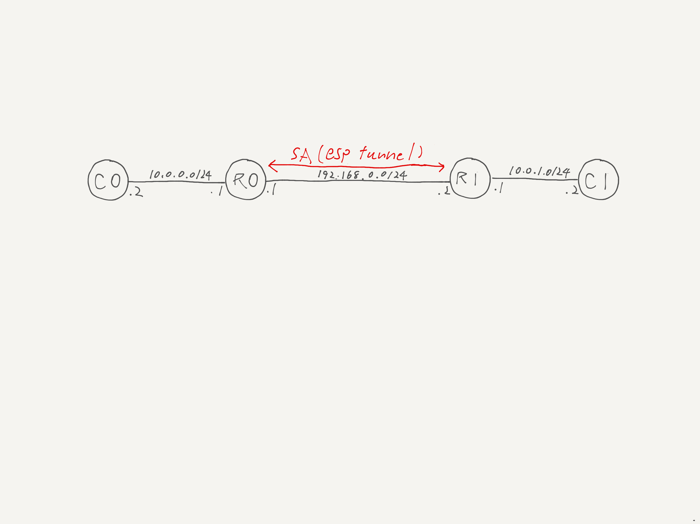

# Simple statically-configured ESP tunnel mode example just works

Establish SA bidirectionally between R0 and R1. Apply xfrm allow policy for the traffic between C0 and C1.



## Demo

Try `tinet test`. Below is an example output. You can see the ICMP packets are correctly encapsulated with ESP header.

```
===================================================
Starting packet capture on R0 (net1) and R1 (net1)
===================================================
tcpdump: listening on net1, link-type EN10MB (Ethernet), snapshot length 262144 bytes
tcpdump: listening on net1, link-type EN10MB (Ethernet), snapshot length 262144 bytes
===================================================
ping from C0 to C1
===================================================
PING 10.0.1.2 (10.0.1.2) 56(84) bytes of data.
64 bytes from 10.0.1.2: icmp_seq=1 ttl=62 time=0.081 ms

--- 10.0.1.2 ping statistics ---
1 packets transmitted, 1 received, 0% packet loss, time 0ms
rtt min/avg/max/mdev = 0.081/0.081/0.081/0.000 ms
===================================================
Stopping packet capture on R0 (net1) and R1 (net1)
===================================================
5 packets captured
5 packets received by filter
0 packets dropped by kernel
5 packets captured
5 packets received by filter
0 packets dropped by kernel
===================================================
Packet capture on R0 (net1)
===================================================
16:23:28.663259 ARP, Request who-has 192.168.0.2 tell 192.168.0.1, length 28
16:23:28.663267 ARP, Reply 192.168.0.2 is-at c6:b7:02:a9:e9:6f, length 28
16:23:28.663267 IP 192.168.0.1 > 192.168.0.2: ESP(spi=0x00000001,seq=0x1), length 120
16:23:28.663294 IP 192.168.0.2 > 192.168.0.1: ESP(spi=0x00000001,seq=0x1), length 120
16:23:28.663294 IP 10.0.1.2 > 10.0.0.2: ICMP echo reply, id 62643, seq 1, length 64
reading from file /tmp/record.pcap, link-type EN10MB (Ethernet), snapshot length 262144
===================================================
Packet capture on R1 (net1)
===================================================
16:23:28.663261 ARP, Request who-has 192.168.0.2 tell 192.168.0.1, length 28
16:23:28.663267 ARP, Reply 192.168.0.2 is-at c6:b7:02:a9:e9:6f, length 28
16:23:28.663268 IP 192.168.0.1 > 192.168.0.2: ESP(spi=0x00000001,seq=0x1), length 120
16:23:28.663268 IP 10.0.0.2 > 10.0.1.2: ICMP echo request, id 62643, seq 1, length 64
16:23:28.663294 IP 192.168.0.2 > 192.168.0.1: ESP(spi=0x00000001,seq=0x1), length 120
reading from file /tmp/record.pcap, link-type EN10MB (Ethernet), snapshot length 262144
```
