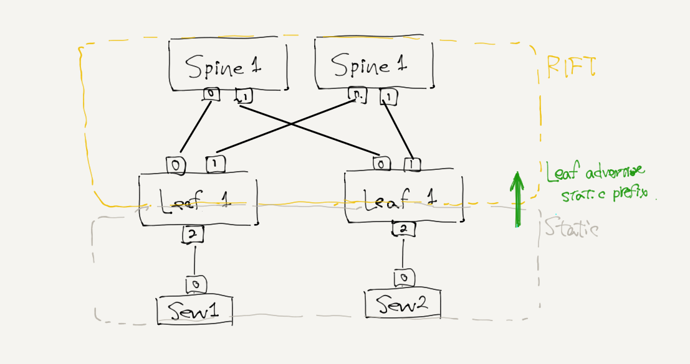

# RIFT: Routing In Fat Tree

This is evaluation of rift-python powered by IETF.

- draft-ietf-rift-rift-03 https://tools.ietf.org/html/draft-ietf-rift-rift-03
- rift-python https://github.com/brunorijsman/rift-python
- juniper's explanation (ppt) https://www.ripe.net/participate/forms/uploads/fobi_plugins/file/see7/Szarkowicz_RIFT_RIPE_TM_bbd50ec4-6dab-4c14-acea-1e767ef7f9da.pptx
- Kobayashi-san's good explanation jp, (this is talking about rift-01).
  https://www.slideshare.net/MasayukiKobayashi/rift-a-new-routing-protocol-for-ip-fabrics
- Miyasaka-san's good explanation jp about IETF100-report that includes about RIFT.
  https://www.isoc.jp/wiki.cgi?action=ATTACH&file=s4%2Dmiyasaka%2Epdf&page=IETF100Update




```
tn upconf | sudo sh
docker exec -it Spine1 telnet localhost `docker exec Spine1 cat /rift`
Trying 127.0.0.1...
Connected to localhost.
Escape character is '^]'.
Spine1> show interfaces
+-----------+------------+-----------+-----------+
| Interface | Neighbor   | Neighbor  | Neighbor  |
| Name      | Name       | System ID | State     |
+-----------+------------+-----------+-----------+
| net0      | Leaf1:net0 | 1001      | THREE_WAY |
+-----------+------------+-----------+-----------+
| net1      | Leaf2:net0 | 1002      | THREE_WAY |
+-----------+------------+-----------+-----------+
```

Basically In the RIFT world, Southbound side was received to-Northbound-route
as a default-route (0.0.0.0/0, 0::/0). We can check that with following cli
```
docker exec Leaf1 ip -4 route list
default proto 99
        nexthop via 99.1.2.2 dev net0 weight 2
        nexthop via 99.3.4.4 dev net1 weight 2
77.1.0.0/24 dev net2 proto kernel scope link src 77.1.0.1
99.1.2.0/24 dev net0 proto kernel scope link src 99.1.2.1
99.3.4.0/24 dev net1 proto kernel scope link src 99.3.4.3
```

