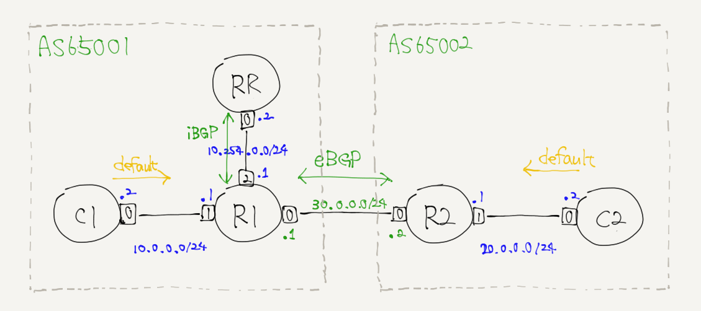

# RTBH: Remotely-Triggered Black Hole Routing



create test traffic
```
host# docker exec -it C2 ping 10.0.0.2 -i0.1
...(snip)
64 bytes from 10.0.0.2: icmp_seq=766 ttl=62 time=0.092 ms
64 bytes from 10.0.0.2: icmp_seq=767 ttl=62 time=0.089 ms
64 bytes from 10.0.0.2: icmp_seq=768 ttl=62 time=0.071 ms
64 bytes from 10.0.0.2: icmp_seq=769 ttl=62 time=0.093 ms
64 bytes from 10.0.0.2: icmp_seq=770 ttl=62 t
...(snip)
```

check traffic
```
R1# watch -n0.1 ip -s link

1: lo: <LOOPBACK,UP,LOWER_UP> mtu 65536 qdisc noqueue state UNKNOWN mode DEFAULT group default qlen 1000
    link/loopback 00:00:00:00:00:00 brd 00:00:00:00:00:00
    RX: bytes  packets  errors  dropped overrun mcast
    0          0        0       0       0       0
    TX: bytes  packets  errors  dropped carrier collsns
    0          0        0       0       0       0
2: net0: <BROADCAST,MULTICAST,UP,LOWER_UP> mtu 1500 qdisc noqueue state UP mode DEFAULT group default qlen 1000
    link/ether 16:7d:a4:a4:1c:4c brd ff:ff:ff:ff:ff:ff link-netnsid 0
    RX: bytes  packets  errors  dropped overrun mcast
    77770      799      0       0       0       0
    TX: bytes  packets  errors  dropped carrier collsns
    74338      765      0       0       0       0
3: net1@if2: <BROADCAST,MULTICAST,UP,LOWER_UP> mtu 1500 qdisc noqueue state UP mode DEFAULT group default qlen 1000
    link/ether d6:70:d3:e4:e0:74 brd ff:ff:ff:ff:ff:ff link-netnsid 1
    RX: bytes  packets  errors  dropped overrun mcast
    72618      745      0       0       0       0
    TX: bytes  packets  errors  dropped carrier collsns
    72618      745      0       0       0       0
4: net2@if2: <BROADCAST,MULTICAST,UP,LOWER_UP> mtu 1500 qdisc noqueue state UP mode DEFAULT group default qlen 1000
    link/ether a2:6c:f6:ee:ce:59 brd ff:ff:ff:ff:ff:ff link-netnsid 2
    RX: bytes  packets  errors  dropped overrun mcast
    1607       21       0       0       0       0
    TX: bytes  packets  errors  dropped carrier collsns
    1467       19       0       0       0       0
```

RTBH operation
```
root@RR# vtysh

Hello, this is FRRouting (version 6.0).
Copyright 1996-2005 Kunihiro Ishiguro, et al.

RR# configure terminal
RR(config)# ip route 10.0.0.2/32 192.2.0.1     // RTBH on
RR(config)# no ip route 10.0.0.2/32 192.2.0.1  // RTBH off
```

references
- http://irs.ietf.to/past/docs_20071011/20071011-irs14-rtbh.pdf page4 discribe fine.
