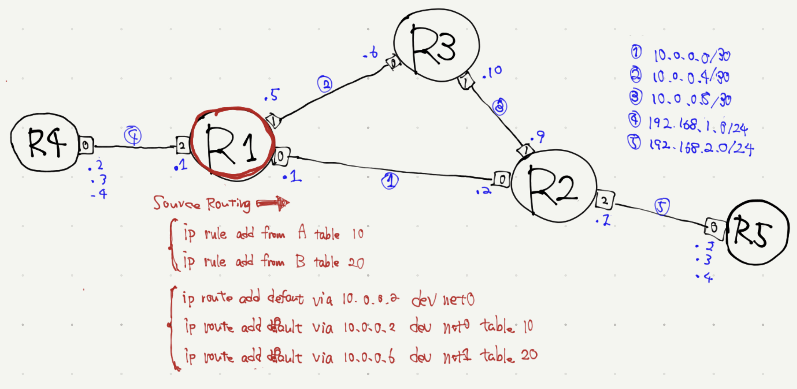

# Source Routing



network operation
```
docker exec R1 ip rule add from 192.168.1.2 table 10
docker exec R1 ip rule add from 192.168.1.3 table 20
docker exec R1 ip route add 192.168.2.0/24 via 10.0.0.2
docker exec R1 ip route add 192.168.2.0/24 via 10.0.0.2 table 10
docker exec R1 ip route add 192.168.2.0/24 via 10.0.0.2 table 20
```

check networking
```
docker exec -it R1 tcpdump -Qout -ni net0
docker exec -it R1 tcpdump -Qout -ni net1
```

