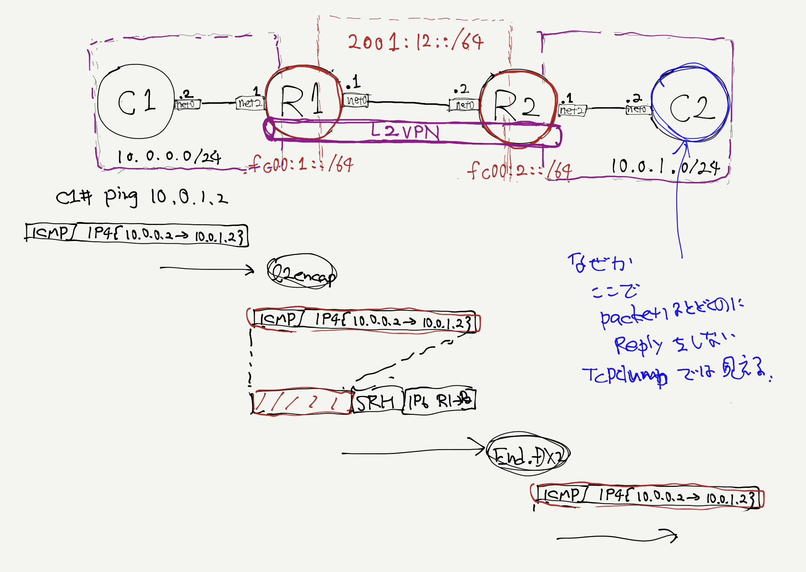

# SRv6 Tiny L2VPN Demonstration
- Hiroki Shirokura <slankdev@coe.ad.jp>
- 2018.12.30



```
$ cd tinet/examples/basic_srv6/l2vpn
$ tn up | sudo sh # create network nodes.
$ tn conf | sudo sh # execute configuration to each nodes
$ docker ps # you can check some nodes exist.
$ tn test p2p | sudo sh # execute point-to-point link's ping.
$ tn test vpn | sudo sh # execute L2VPN ping. // can't be success
```
