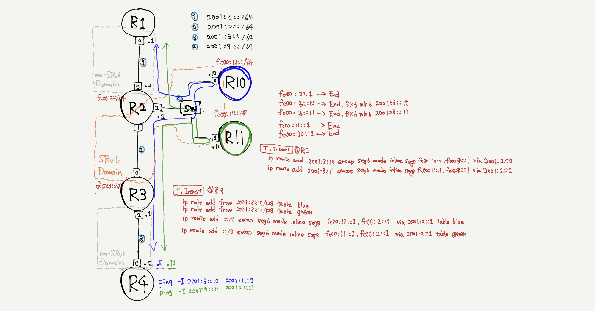

# SFC using SRv6



```
tn upconf | sudo sh
```

make test traffic
```
docker exec -it R4 ping -I 2001:3::2 2001:1::1
docker exec -it R4 ping -I 2001:3::10 2001:1::1
docker exec -it R4 ping -I 2001:3::11 2001:1::1
```

check networking
```
docker exec -it R10 tcpdump -ni net0
docker exec -it R11 tcpdump -ni net0
```

SRv6 Configuration
```
//decoder @R2
ip route add fc00:2::5 encap seg6local action End via 2001:1::1
ip route add 2001:3::10 encap seg6 mode inline segs fc00:10::1,fc00:3::1 via 2001:2::1
ip route add 2001:3::11 encap seg6 mode inline segs fc00:11::1,fc00:3::1 via 2001:2::1

//encoder @R3
echo 10 blue >> /etc/iproute2/rt_tables
echo 11 green >> /etc/iproute2/rt_tables
ip -6 rule add from 2001:3::10 table blue
ip -6 rule add from 2001:3::11 table green
ip route add 2001:1::0/64 encap seg6 mode inline segs fc00:10::1,fc00:2::1 via 2001:2::1 table blue
ip route add 2001:1::0/64 encap seg6 mode inline segs fc00:11::1,fc00:2::1 via 2001:2::1 table green
```

