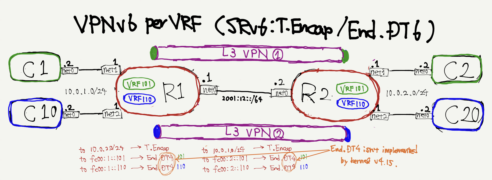

# VPNv4 per-VRF using SRv6
**VERY-IMPORTANT-NOTICE:**<br>
Currentry latest-stable(4.15), End.DT4 isn't supported.
So, this example can't be working.

- Hiroki Shirokura <slankdev@coe.ad.jp>
- 2018.12.31



```
$ cd tinet/projects/basic_srv6/l3vpn
$ tn up | sudo sh # create network nodes.
$ tn conf | sudo sh # execute configuration to each nodes
$ docker ps # you can check some nodes exist.
$ tn test p2p | sudo sh # execute point-to-point link's ping.
$ tn test vpn | sudo sh # execute L3VPN ping.
```
