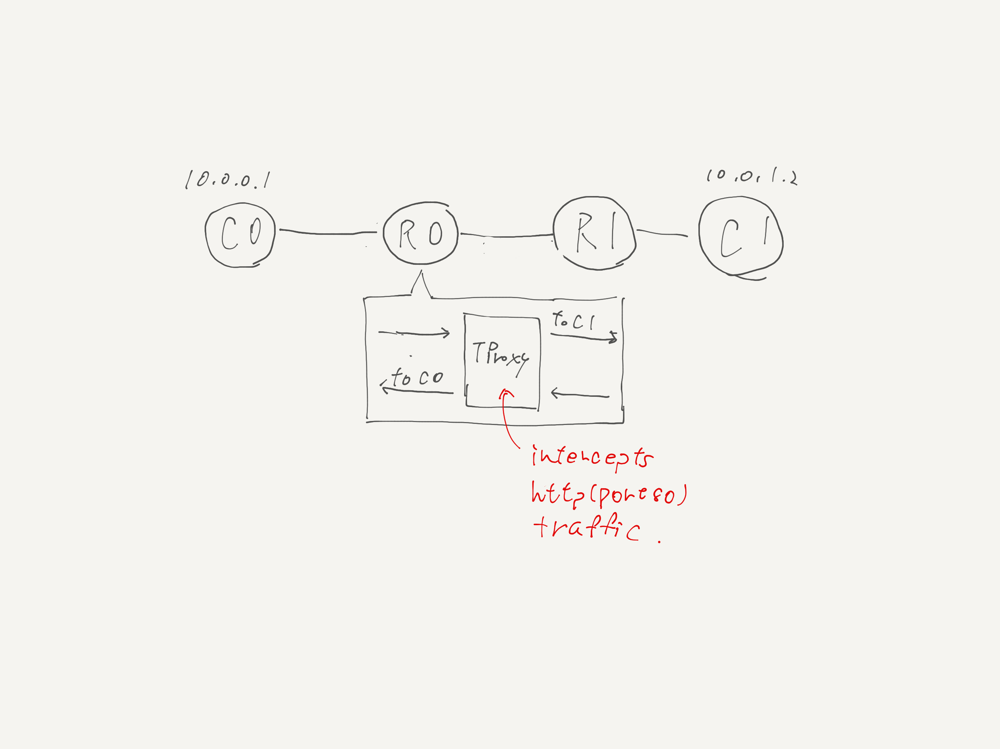

# Simple TPROXY example



This example demonstrates the basic cocept of TPROXY (a.k.a. transparent proxy). The very simple proxy server (tproxy.c) transparently intercepts the HTTP traffic between C0 and C1 and dumps the request/response to stdout.

Build `tproxy:latest` docker image

```
tinet build | sudo bash
```

Run demo

```
tinet test | sudo bash
```
