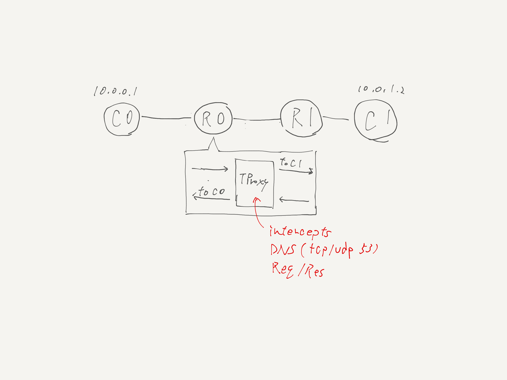

# DNS interception with TPROXY



This example implements a very simple DNS transparent proxy using TPROXY. It intercepts both of UDP and TCP query and dumps the request/response to stdout.

Build `dns-interceptor:latest` docker image

```
tinet build | sudo bash
```

Run demo

```
tinet test | sudo bash
```
