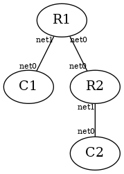

# gobgp-grpc-demo

**The experimental environment was prepared with [tinet](https://github.com/ak1ra24/tinet-go)**

## Directory Tree
```
.
├── README.md
├── add_path01.py
├── add_path02.py
├── gobgp01.conf
├── gobgp02.conf
└── spec.yaml
```

## Topo


## How to Use
* C1
```
docker exec -it C1 bash
cd gobgp/api
python3 add_path.py
```

* C2
```
docker exec -it C2 bash
cd gobgp/api
python3 add_path.py
```

* R1
```
docker exec -it R1 bash
root@R1:~# gobgp g r
   Network              Next Hop             AS_PATH              Age        Attrs
*> 192.168.10.0/24      0.0.0.0                                   00:56:16   [{Origin: ?}]
*> 192.168.20.0/24      10.0.0.2             65001                00:56:05   [{Origin: ?}]
```

## Test
* C1
```
docker exec -it C1 ping -c2 192.168.20.2
```

* C2
```
docker exec -it C2 ping -c2 192.168.20.2
```